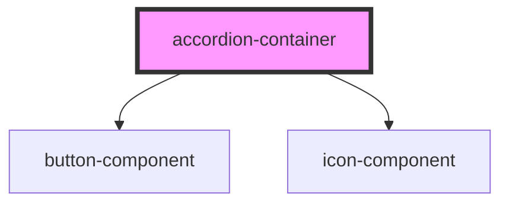

# accordion-container

<!-- Auto Generated Below -->

## Properties

| Property         | Attribute          | Description                                                                       | Type                                     | Default               |
| ---------------- | ------------------ | --------------------------------------------------------------------------------- | ---------------------------------------- | --------------------- |
| `block`          | `block`            |                                                                                   | `boolean`                                | `false`               |
| `classNames`     | `class-names`      |                                                                                   | `string`                                 | `''`                  |
| `contentTxtSize` | `content-txt-size` |                                                                                   | `string`                                 | `''`                  |
| `data`           | --                 |                                                                                   | `{ header: string; content: string; }[]` | `[]`                  |
| `disabled`       | `disabled`         |                                                                                   | `boolean`                                | `false`               |
| `flush`          | `flush`            |                                                                                   | `boolean`                                | `false`               |
| `icon`           | `icon`             |                                                                                   | `string`                                 | `'fas fa-angle-down'` |
| `outlined`       | `outlined`         |                                                                                   | `boolean`                                | `false`               |
| `parentId`       | `parent-id`        | A unique id for THIS accordion container. If not provided, one will be generated. | `string`                                 | `''`                  |
| `ripple`         | `ripple`           |                                                                                   | `boolean`                                | `false`               |
| `singleOpen`     | `single-open`      |                                                                                   | `boolean`                                | `false`               |
| `size`           | `size`             |                                                                                   | `string`                                 | `''`                  |
| `variant`        | `variant`          |                                                                                   | `string`                                 | `''`                  |

## Dependencies

### Depends on

- [button-component](../button)
- [icon-component](../icon)

### Graph

----------------------------------------------

*Built with [StencilJS](https://stenciljs.com/)*
