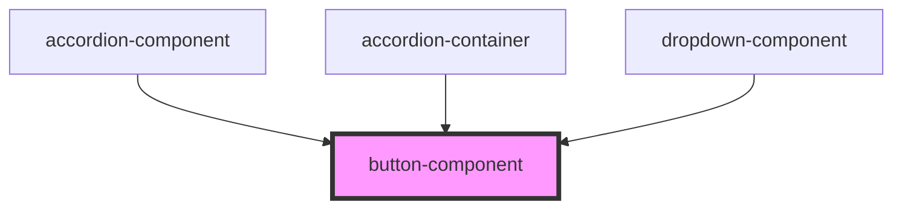

# pl-button

<!-- Auto Generated Below -->

## Properties

| Property                 | Attribute                  | Description                                                                                                                                                 | Type                | Default     |
| ------------------------ | -------------------------- | ----------------------------------------------------------------------------------------------------------------------------------------------------------- | ------------------- | ----------- |
| `absolute`               | `absolute`                 |                                                                                                                                                             | `boolean`           | `false`     |
| `accordion`              | `accordion`                |                                                                                                                                                             | `boolean`           | `false`     |
| `active`                 | `active`                   |                                                                                                                                                             | `boolean`           | `false`     |
| `allowFocusableChildren` | `allow-focusable-children` | Allow consumers to opt-out of nested focusable neutralization (e.g., if they need an actual focusable child on purpose).                                    | `boolean`           | `false`     |
| `ariaLabel`              | `aria-label`               |                                                                                                                                                             | `string`            | `''`        |
| `block`                  | `block`                    |                                                                                                                                                             | `boolean`           | `false`     |
| `bottom`                 | `bottom`                   |                                                                                                                                                             | `string`            | `''`        |
| `btnIcon`                | `btn-icon`                 |                                                                                                                                                             | `boolean`           | `false`     |
| `btnText`                | `btn-text`                 |                                                                                                                                                             | `string`            | `''`        |
| `classNames`             | `class-names`              |                                                                                                                                                             | `string`            | `''`        |
| `devMode`                | `dev-mode`                 |                                                                                                                                                             | `boolean`           | `false`     |
| `disabled`               | `disabled`                 |                                                                                                                                                             | `boolean`           | `false`     |
| `elevation`              | `elevation`                |                                                                                                                                                             | `string`            | `''`        |
| `end`                    | `end`                      |                                                                                                                                                             | `boolean`           | `false`     |
| `fixed`                  | `fixed`                    |                                                                                                                                                             | `boolean`           | `false`     |
| `groupBtn`               | `group-btn`                |                                                                                                                                                             | `boolean`           | `false`     |
| `iconBtn`                | `icon-btn`                 |                                                                                                                                                             | `boolean`           | `false`     |
| `isOpen`                 | `is-open`                  |                                                                                                                                                             | `boolean`           | `false`     |
| `left`                   | `left`                     |                                                                                                                                                             | `string`            | `''`        |
| `link`                   | `link`                     |                                                                                                                                                             | `boolean`           | `false`     |
| `outlined`               | `outlined`                 |                                                                                                                                                             | `boolean`           | `false`     |
| `pressed`                | `pressed`                  | Current pressed state (for toggle buttons). Reflected & mutable so markup stays clean: - attribute omitted when false - attribute present (empty) when true | `boolean`           | `false`     |
| `right`                  | `right`                    |                                                                                                                                                             | `string`            | `''`        |
| `ripple`                 | `ripple`                   |                                                                                                                                                             | `boolean`           | `false`     |
| `shape`                  | `shape`                    |                                                                                                                                                             | `string`            | `''`        |
| `size`                   | `size`                     |                                                                                                                                                             | `string`            | `''`        |
| `slotSide`               | `slot-side`                |                                                                                                                                                             | `"left" \| "right"` | `undefined` |
| `start`                  | `start`                    |                                                                                                                                                             | `boolean`           | `false`     |
| `stripped`               | `stripped`                 |                                                                                                                                                             | `boolean`           | `false`     |
| `styles`                 | `styles`                   |                                                                                                                                                             | `string`            | `''`        |
| `targetId`               | `target-id`                |                                                                                                                                                             | `string`            | `''`        |
| `text`                   | `text`                     |                                                                                                                                                             | `boolean`           | `false`     |
| `textBtn`                | `text-btn`                 |                                                                                                                                                             | `boolean`           | `false`     |
| `titleAttr`              | `title-attr`               |                                                                                                                                                             | `string`            | `''`        |
| `toggle`                 | `toggle`                   | Enable toggle-button behavior. When true, clicking (or keyboard activate) flips the `pressed` state.                                                        | `boolean`           | `false`     |
| `top`                    | `top`                      |                                                                                                                                                             | `string`            | `''`        |
| `url`                    | `url`                      |                                                                                                                                                             | `string`            | `''`        |
| `variant`                | `variant`                  |                                                                                                                                                             | `string`            | `''`        |
| `vertical`               | `vertical`                 |                                                                                                                                                             | `boolean`           | `false`     |
| `zIndex`                 | `z-index`                  |                                                                                                                                                             | `string`            | `''`        |

## Events

| Event           | Description                                                                    | Type                   |
| --------------- | ------------------------------------------------------------------------------ | ---------------------- |
| `customClick`   |                                                                                | `CustomEvent<void>`    |
| `pressedChange` | Fired whenever `pressed` changes (useful for external sync / two-way binding). | `CustomEvent<boolean>` |

## Dependencies

### Used by

 - [accordion-component](../accordion)
 - [accordion-container](../accordion-container)
 - [dropdown-component](../dropdown)

### Graph

----------------------------------------------

*Built with [StencilJS](https://stenciljs.com/)*
