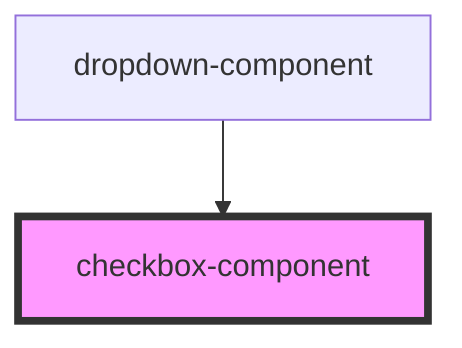

# checkbox-component

<!-- Auto Generated Below -->

## Properties

| Property              | Attribute               | Description | Type      | Default |
| --------------------- | ----------------------- | ----------- | --------- | ------- |
| `checkbox`            | `checkbox`              |             | `boolean` | `false` |
| `checkboxGroup`       | `checkbox-group`        |             | `boolean` | `false` |
| `checked`             | `checked`               |             | `boolean` | `false` |
| `customCheckbox`      | `custom-checkbox`       |             | `boolean` | `false` |
| `customCheckboxGroup` | `custom-checkbox-group` |             | `boolean` | `false` |
| `disabled`            | `disabled`              |             | `boolean` | `false` |
| `groupOptions`        | `group-options`         |             | `any`     | `[]`    |
| `groupTitle`          | `group-title`           |             | `string`  | `''`    |
| `groupTitleSize`      | `group-title-size`      |             | `string`  | `''`    |
| `inline`              | `inline`                |             | `boolean` | `false` |
| `inputId`             | `input-id`              |             | `string`  | `''`    |
| `labelTxt`            | `label-txt`             |             | `string`  | `''`    |
| `name`                | `name`                  |             | `string`  | `''`    |
| `noPadding`           | `no-padding`            |             | `boolean` | `false` |
| `required`            | `required`              |             | `boolean` | `false` |
| `size`                | `size`                  |             | `string`  | `''`    |
| `validation`          | `validation`            |             | `boolean` | `false` |
| `validationMsg`       | `validation-msg`        |             | `string`  | `''`    |
| `value`               | `value`                 |             | `string`  | `''`    |

## Events

| Event         | Description | Type                    |
| ------------- | ----------- | ----------------------- |
| `groupChange` |             | `CustomEvent<string[]>` |

## Dependencies

### Used by

 - [dropdown-component](../dropdown)

### Graph

----------------------------------------------

*Built with [StencilJS](https://stenciljs.com/)*
