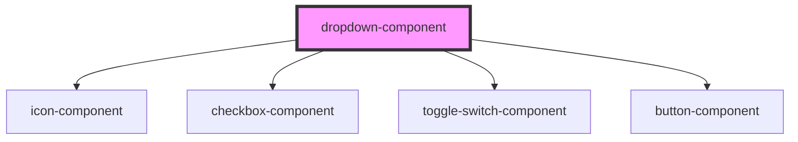

# dropdown-component

<!-- Auto Generated Below -->

## Properties

| Property           | Attribute            | Description | Type                                           | Default      |
| ------------------ | -------------------- | ----------- | ---------------------------------------------- | ------------ |
| `alignMenuRight`   | `align-menu-right`   |             | `boolean`                                      | `false`      |
| `autoFocusSubmenu` | `auto-focus-submenu` |             | `boolean`                                      | `false`      |
| `buttonText`       | `button-text`        |             | `string`                                       | `'Dropdown'` |
| `disabled`         | `disabled`           |             | `boolean`                                      | `false`      |
| `icon`             | `icon`               |             | `string`                                       | `''`         |
| `iconDropdown`     | `icon-dropdown`      |             | `boolean`                                      | `false`      |
| `iconSize`         | `icon-size`          |             | `number`                                       | `undefined`  |
| `inputId`          | `input-id`           |             | `string`                                       | `''`         |
| `listType`         | `list-type`          |             | `string`                                       | `'default'`  |
| `menuOffsetY`      | `menu-offset-y`      |             | `number`                                       | `0`          |
| `name`             | `name`               |             | `string`                                       | `''`         |
| `options`          | --                   |             | `DropdownItem[]`                               | `[]`         |
| `outlined`         | `outlined`           |             | `boolean`                                      | `false`      |
| `ripple`           | `ripple`             |             | `boolean`                                      | `false`      |
| `shape`            | `shape`              |             | `string`                                       | `''`         |
| `size`             | `size`               |             | `"" \| "lg" \| "plumage-size" \| "sm" \| "xs"` | `''`         |
| `subMenuListType`  | `sub-menu-list-type` |             | `string`                                       | `'default'`  |
| `submenuOffsetX`   | `submenu-offset-x`   |             | `number`                                       | `0`          |
| `tableId`          | `table-id`           |             | `string`                                       | `''`         |
| `titleAttr`        | `title-attr`         |             | `string`                                       | `''`         |
| `value`            | `value`              |             | `string`                                       | `''`         |
| `variant`          | `variant`            |             | `string`                                       | `'default'`  |

## Events

| Event          | Description | Type               |
| -------------- | ----------- | ------------------ |
| `itemSelected` |             | `CustomEvent<any>` |

## Dependencies

### Depends on

- [icon-component](../icon)
- [checkbox-component](../checkbox)
- [toggle-switch-component](../toggle-switch)
- [button-component](../button)

### Graph

----------------------------------------------

*Built with [StencilJS](https://stenciljs.com/)*
