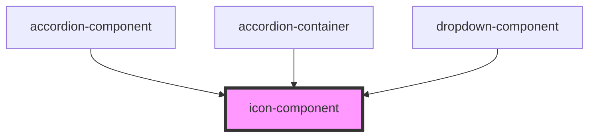

# icon-component

<!-- Auto Generated Below -->

## Properties

| Property         | Attribute          | Description | Type      | Default     |
| ---------------- | ------------------ | ----------- | --------- | ----------- |
| `color`          | `color`            |             | `string`  | `undefined` |
| `icon`           | `icon`             |             | `string`  | `''`        |
| `iconAriaHidden` | `icon-aria-hidden` |             | `boolean` | `true`      |
| `iconAriaLabel`  | `icon-aria-label`  |             | `string`  | `undefined` |
| `iconMargin`     | `icon-margin`      |             | `string`  | `''`        |
| `iconSize`       | `icon-size`        |             | `number`  | `undefined` |
| `size`           | `size`             |             | `string`  | `''`        |
| `svg`            | `svg`              |             | `boolean` | `false`     |
| `tokenIcon`      | `token-icon`       |             | `boolean` | `false`     |

## Dependencies

### Used by

 - [accordion-component](../accordion)
 - [accordion-container](../accordion-container)
 - [dropdown-component](../dropdown)

### Graph

----------------------------------------------

*Built with [StencilJS](https://stenciljs.com/)*
