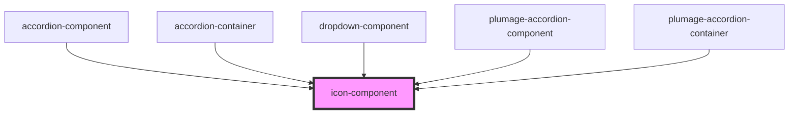

# icon-component

<!-- Auto Generated Below -->

## Properties

| Property         | Attribute          | Description                                                                                                                        | Type      | Default     |
| ---------------- | ------------------ | ---------------------------------------------------------------------------------------------------------------------------------- | --------- | ----------- |
| `color`          | `color`            |                                                                                                                                    | `string`  | `undefined` |
| `icon`           | `icon`             |                                                                                                                                    | `string`  | `''`        |
| `iconAriaHidden` | `icon-aria-hidden` |                                                                                                                                    | `boolean` | `true`      |
| `iconAriaLabel`  | `icon-aria-label`  | Accessibility: - Decorative by default: aria-hidden="true" - Meaningful icon: set iconAriaHidden={false} AND provide iconAriaLabel | `string`  | `undefined` |
| `iconMargin`     | `icon-margin`      |                                                                                                                                    | `string`  | `''`        |
| `iconSize`       | `icon-size`        |                                                                                                                                    | `number`  | `undefined` |
| `size`           | `size`             |                                                                                                                                    | `string`  | `''`        |
| `tokenIcon`      | `token-icon`       |                                                                                                                                    | `boolean` | `false`     |

## Dependencies

### Used by

 - [accordion-component](../accordion)
 - [accordion-container](../accordion-container)
 - [dropdown-component](../dropdown)
 - [plumage-accordion-component](../plumage-accordion)
 - [plumage-accordion-container](../plumage-accordion-container)

### Graph

```mermaid
graph TD;
  accordion-component --> icon-component
  accordion-container --> icon-component
  dropdown-component --> icon-component
  plumage-accordion-component --> icon-component
  plumage-accordion-container --> icon-component
  style icon-component fill:#f9f,stroke:#333,stroke-width:4px
```

----------------------------------------------

*Built with [StencilJS](https://stenciljs.com/)*
