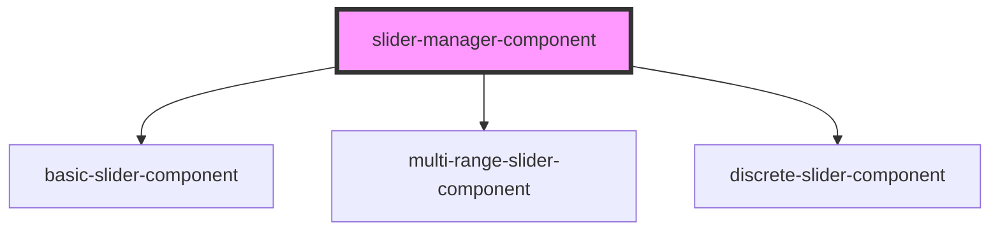

# slider-manager-component

<!-- Auto Generated Below -->

## Properties

| Property           | Attribute             | Description                      | Type                                                                                       | Default   |
| ------------------ | --------------------- | -------------------------------- | ------------------------------------------------------------------------------------------ | --------- |
| `disabled`         | `disabled`            |                                  | `boolean`                                                                                  | `false`   |
| `hideLeftTextBox`  | `hide-left-text-box`  |                                  | `boolean`                                                                                  | `false`   |
| `hideRightTextBox` | `hide-right-text-box` |                                  | `boolean`                                                                                  | `false`   |
| `hideTextBoxes`    | `hide-text-boxes`     |                                  | `boolean`                                                                                  | `false`   |
| `label`            | `label`               |                                  | `string`                                                                                   | `''`      |
| `lowerValue`       | `lower-value`         |                                  | `number`                                                                                   | `25`      |
| `max`              | `max`                 |                                  | `number`                                                                                   | `100`     |
| `min`              | `min`                 |                                  | `number`                                                                                   | `0`       |
| `plumage`          | `plumage`             |                                  | `boolean`                                                                                  | `false`   |
| `selectedIndex`    | `selected-index`      |                                  | `number`                                                                                   | `0`       |
| `sliderThumbLabel` | `slider-thumb-label`  |                                  | `boolean`                                                                                  | `false`   |
| `snapToTicks`      | `snap-to-ticks`       |                                  | `boolean`                                                                                  | `false`   |
| `stringValues`     | `string-values`       |                                  | `string[]`                                                                                 | `[]`      |
| `tickLabels`       | `tick-labels`         |                                  | `boolean`                                                                                  | `false`   |
| `tickValues`       | `tick-values`         |                                  | `number[]`                                                                                 | `[]`      |
| `type`             | `type`                | 'basic' \| 'multi' \| 'discrete' | `"basic" \| "discrete" \| "multi"`                                                         | `'basic'` |
| `unit`             | `unit`                |                                  | `string`                                                                                   | `''`      |
| `upperValue`       | `upper-value`         |                                  | `number`                                                                                   | `75`      |
| `value`            | `value`               |                                  | `number`                                                                                   | `0`       |
| `variant`          | `variant`             |                                  | `"" \| "danger" \| "dark" \| "info" \| "primary" \| "secondary" \| "success" \| "warning"` | `''`      |

## Dependencies

### Depends on

- [basic-slider-component](.)
- [multi-range-slider-component](.)
- [discrete-slider-component](.)

### Graph

----------------------------------------------

*Built with [StencilJS](https://stenciljs.com/)*
