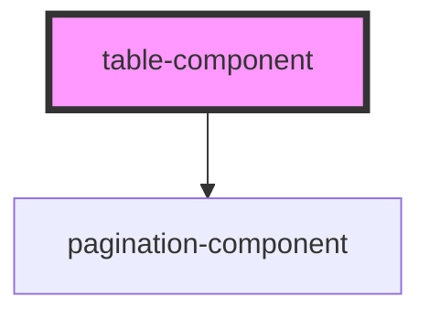

# table-component

<!-- Auto Generated Below -->

## Properties

| Property                 | Attribute                  | Description | Type                                                                                                             | Default                    |
| ------------------------ | -------------------------- | ----------- | ---------------------------------------------------------------------------------------------------------------- | -------------------------- |
| `border`                 | `border`                   |             | `boolean`                                                                                                        | `false`                    |
| `bordered`               | `bordered`                 |             | `boolean`                                                                                                        | `false`                    |
| `borderless`             | `borderless`               |             | `boolean`                                                                                                        | `false`                    |
| `caption`                | `caption`                  |             | `"" \| "bottom" \| "top"`                                                                                        | `''`                       |
| `cloneFooter`            | `clone-footer`             |             | `boolean`                                                                                                        | `false`                    |
| `currentPage`            | `current-page`             |             | `number`                                                                                                         | `1`                        |
| `dark`                   | `dark`                     |             | `boolean`                                                                                                        | `false`                    |
| `dropdownId`             | `dropdown-id`              |             | `string`                                                                                                         | `''`                       |
| `expandedRows`           | --                         |             | `number[]`                                                                                                       | `[]`                       |
| `fields`                 | --                         |             | `Field[]`                                                                                                        | `[]`                       |
| `filterText`             | `filter-text`              |             | `string`                                                                                                         | `''`                       |
| `fixed`                  | `fixed`                    |             | `boolean`                                                                                                        | `false`                    |
| `goToButtons`            | `go-to-buttons`            |             | `string`                                                                                                         | `''`                       |
| `headerDark`             | `header-dark`              |             | `boolean`                                                                                                        | `false`                    |
| `headerLight`            | `header-light`             |             | `boolean`                                                                                                        | `false`                    |
| `hideEllipsis`           | `hide-ellipsis`            |             | `boolean`                                                                                                        | `false`                    |
| `hideGotoEndButtons`     | `hide-goto-end-buttons`    |             | `boolean`                                                                                                        | `false`                    |
| `hover`                  | `hover`                    |             | `boolean`                                                                                                        | `false`                    |
| `items`                  | --                         |             | `any[]`                                                                                                          | `[]`                       |
| `noBorderCollapsed`      | `no-border-collapsed`      |             | `boolean`                                                                                                        | `false`                    |
| `originalItems`          | --                         |             | `any[]`                                                                                                          | `[]`                       |
| `pageSizeOptions`        | --                         |             | `(number \| "All")[]`                                                                                            | `[10, 20, 50, 100, 'All']` |
| `paginationLayout`       | `pagination-layout`        |             | `string`                                                                                                         | `''`                       |
| `paginationLimit`        | `pagination-limit`         |             | `number`                                                                                                         | `5`                        |
| `paginationPosition`     | `pagination-position`      |             | `"both" \| "bottom" \| "top"`                                                                                    | `'bottom'`                 |
| `paginationSize`         | `pagination-size`          |             | `"" \| "lg" \| "sm"`                                                                                             | `''`                       |
| `paginationVariantColor` | `pagination-variant-color` |             | `string`                                                                                                         | `''`                       |
| `plumage`                | `plumage`                  |             | `boolean`                                                                                                        | `false`                    |
| `responsive`             | `responsive`               |             | `boolean`                                                                                                        | `false`                    |
| `rowsPerPage`            | `rows-per-page`            |             | `number`                                                                                                         | `10`                       |
| `selectMode`             | `select-mode`              |             | `"" \| "multi" \| "range" \| "single"`                                                                           | `''`                       |
| `selectedFilterFields`   | --                         |             | `string[]`                                                                                                       | `[]`                       |
| `selectedRows`           | --                         |             | `any[]`                                                                                                          | `[]`                       |
| `selectedVariant`        | `selected-variant`         |             | `string`                                                                                                         | `'table-active'`           |
| `showDisplayRange`       | `show-display-range`       |             | `boolean`                                                                                                        | `false`                    |
| `showSizeChanger`        | `show-size-changer`        |             | `boolean`                                                                                                        | `false`                    |
| `size`                   | `size`                     |             | `"" \| "sm"`                                                                                                     | `''`                       |
| `sortCriteria`           | --                         |             | `{ key: string; order: SortOrder \| "none"; }[]`                                                                 | `[]`                       |
| `sortField`              | `sort-field`               |             | `string`                                                                                                         | `'none'`                   |
| `sortOrder`              | `sort-order`               |             | `"asc" \| "desc"`                                                                                                | `'asc'`                    |
| `sortOrderDisabled`      | `sort-order-disabled`      |             | `boolean`                                                                                                        | `true`                     |
| `sortable`               | `sortable`                 |             | `boolean`                                                                                                        | `false`                    |
| `stacked`                | `stacked`                  |             | `boolean`                                                                                                        | `false`                    |
| `sticky`                 | `sticky`                   |             | `boolean`                                                                                                        | `false`                    |
| `striped`                | `striped`                  |             | `boolean`                                                                                                        | `false`                    |
| `tableId`                | `table-id`                 |             | `string`                                                                                                         | `''`                       |
| `tableVariant`           | `table-variant`            |             | `"" \| "danger" \| "dark" \| "info" \| "light" \| "primary" \| "secondary" \| "success" \| "table" \| "warning"` | `'table'`                  |
| `totalRows`              | `total-rows`               |             | `number`                                                                                                         | `0`                        |
| `useByPagePagination`    | `use-by-page-pagination`   |             | `boolean`                                                                                                        | `false`                    |
| `useMinimizePagination`  | `use-minimize-pagination`  |             | `boolean`                                                                                                        | `false`                    |
| `usePagination`          | `use-pagination`           |             | `boolean`                                                                                                        | `false`                    |

## Events

| Event                | Description | Type                                             |
| -------------------- | ----------- | ------------------------------------------------ |
| `row-selected`       |             | `CustomEvent<any[]>`                             |
| `sort-changed`       |             | `CustomEvent<{ field: string; order: string; }>` |
| `sort-field-updated` |             | `CustomEvent<{ value: string; }>`                |
| `sort-order-updated` |             | `CustomEvent<{ value: string; }>`                |

## Methods

### `resetSort() => Promise<void>`

#### Returns

Type: `Promise<void>`

## Dependencies

### Depends on

- [pagination-component](../pagination)

### Graph

----------------------------------------------

*Built with [StencilJS](https://stenciljs.com/)*
