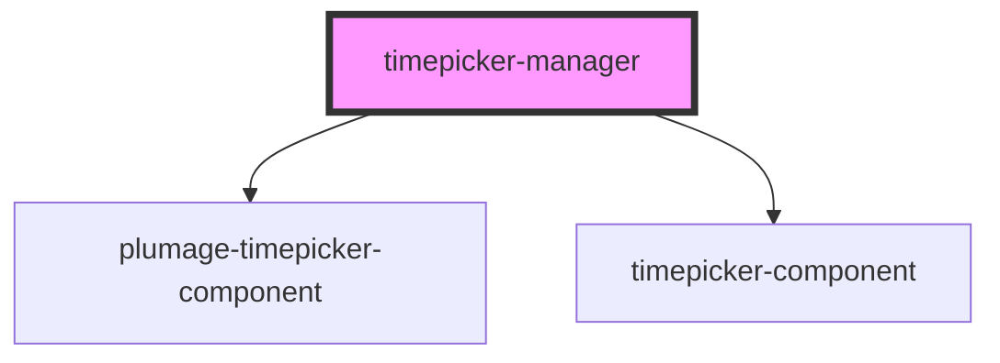

# timepicker-manager

<!-- Auto Generated Below -->

## Properties

| Property                 | Attribute                    | Description                                                                                                                                                                   | Type               | Default         |
| ------------------------ | ---------------------------- | ----------------------------------------------------------------------------------------------------------------------------------------------------------------------------- | ------------------ | --------------- |
| `ariaLabel`              | `aria-label`                 | Accessible label for the input                                                                                                                                                | `string`           | `'Time Picker'` |
| `ariaLabelledby`         | `aria-labelledby`            | ID of the external label element (for aria-labelledby)                                                                                                                        | `string`           | `'time-label'`  |
| `disableTimepicker`      | `disable-timepicker`         | Disable the timepicker. - For <timepicker-component>: passed as `disableTimepicker` - For <plumage-timepicker-component>: passed as `disabled`                                | `boolean`          | `false`         |
| `hideSeconds`            | `hide-seconds`               | Hide seconds UI / value                                                                                                                                                       | `boolean`          | `false`         |
| `hideTimepickerBtn`      | `hide-timepicker-btn`        | Hide the toggle/launch button for the timepicker popover                                                                                                                      | `boolean`          | `false`         |
| `inputId`                | `input-id`                   | ID to pass to inner input(s)                                                                                                                                                  | `string`           | `'time-input'`  |
| `inputName`              | `input-name`                 | Name attribute for the inner input                                                                                                                                            | `string`           | `'time'`        |
| `inputWidth`             | `input-width`                | Width (px) for the input element                                                                                                                                              | `number \| string` | `null`          |
| `isTwentyFourHourFormat` | `is-twenty-four-hour-format` | Use 24-hour format by default                                                                                                                                                 | `boolean`          | `true`          |
| `isValid`                | `is-valid`                   | Whether the current value is considered valid                                                                                                                                 | `boolean`          | `true`          |
| `labelText`              | `label-text`                 |                                                                                                                                                                               | `string`           | `'Enter Time'`  |
| `required`               | `required`                   | Required indicator (Plumage label asterisk, etc.)                                                                                                                             | `boolean`          | `false`         |
| `showLabel`              | `show-label`                 |                                                                                                                                                                               | `boolean`          | `undefined`     |
| `size`                   | `size`                       | Optional size variant (e.g., 'sm', 'lg')                                                                                                                                      | `string`           | `''`            |
| `twelveHourOnly`         | `twelve-hour-only`           | Force show only 12-hour controls/options                                                                                                                                      | `boolean`          | `false`         |
| `twentyFourHourOnly`     | `twenty-four-hour-only`      | Force show only 24-hour controls/options                                                                                                                                      | `boolean`          | `false`         |
| `usePlTimepicker`        | `use-pl-timepicker`          | Choose which implementation to render: false = <timepicker-component>, true = <plumage-timepicker-component>                                                                  | `boolean`          | `false`         |
| `validation`             | `validation`                 | External invalid/validation styling flag (drives `invalid` / `is-invalid` styling in children). NOTE: children now clear this internally on clear/typing/spinner interaction. | `boolean`          | `false`         |
| `validationMessage`      | `validation-message`         | Validation message to show (if any). NOTE: children now clear this internally on clear/typing/spinner interaction.                                                            | `string`           | `''`            |

## Dependencies

### Depends on

- [plumage-timepicker-component](.)
- [timepicker-component](.)

### Graph

----------------------------------------------

*Built with [StencilJS](https://stenciljs.com/)*
