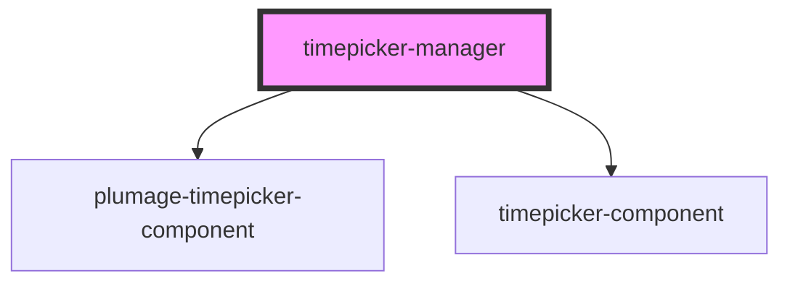

# timepicker-manager

<!-- Auto Generated Below -->

## Properties

| Property                 | Attribute                    | Description | Type               | Default        |
| ------------------------ | ---------------------------- | ----------- | ------------------ | -------------- |
| `ariaDescribedby`        | `aria-describedby`           |             | `string`           | `undefined`    |
| `ariaLabel`              | `aria-label`                 |             | `string`           | `undefined`    |
| `ariaLabelledby`         | `aria-labelledby`            |             | `string`           | `undefined`    |
| `disableTimepicker`      | `disable-timepicker`         |             | `boolean`          | `false`        |
| `hideSeconds`            | `hide-seconds`               |             | `boolean`          | `false`        |
| `hideTimepickerBtn`      | `hide-timepicker-btn`        |             | `boolean`          | `false`        |
| `inputId`                | `input-id`                   |             | `string`           | `'time-input'` |
| `inputName`              | `input-name`                 |             | `string`           | `'time'`       |
| `inputWidth`             | `input-width`                |             | `number \| string` | `null`         |
| `isTwentyFourHourFormat` | `is-twenty-four-hour-format` |             | `boolean`          | `true`         |
| `isValid`                | `is-valid`                   |             | `boolean`          | `true`         |
| `labelText`              | `label-text`                 |             | `string`           | `'Enter Time'` |
| `required`               | `required`                   |             | `boolean`          | `false`        |
| `showLabel`              | `show-label`                 |             | `boolean`          | `undefined`    |
| `size`                   | `size`                       |             | `string`           | `''`           |
| `timeInputThrottleMs`    | `time-input-throttle-ms`     |             | `number`           | `50`           |
| `twelveHourOnly`         | `twelve-hour-only`           |             | `boolean`          | `false`        |
| `twentyFourHourOnly`     | `twenty-four-hour-only`      |             | `boolean`          | `false`        |
| `usePlTimepicker`        | `use-pl-timepicker`          |             | `boolean`          | `false`        |
| `validation`             | `validation`                 |             | `boolean`          | `false`        |
| `validationMessage`      | `validation-message`         |             | `string`           | `''`           |
| `value`                  | `value`                      |             | `string`           | `''`           |

## Events

| Event               | Description                           | Type                                                                                                                                                                                                    |
| ------------------- | ------------------------------------- | ------------------------------------------------------------------------------------------------------------------------------------------------------------------------------------------------------- |
| `managerTimeChange` | Namespaced events to avoid collisions | `CustomEvent<TimeChangeDetail & { managerInputId: string; impl: "plumage-timepicker-component" \| "timepicker-component"; }>`                                                                           |
| `managerTimeInput`  |                                       | `CustomEvent<TimeInputDetail & { managerInputId: string; impl: "plumage-timepicker-component" \| "timepicker-component"; }>`                                                                            |
| `timeChange`        |                                       | `CustomEvent<{ value: string; parts: TimeParts; isValid: boolean; source: "commit" \| "spinner" \| "clear" \| "format" \| "external" \| "inputName" \| "inputId" \| "constraints" \| "hideSeconds"; }>` |
| `timeInput`         |                                       | `CustomEvent<{ raw: string; normalized: string; isValid: boolean; parts?: TimeParts; reason?: "pattern" \| "range"; caretStart: number; caretEnd: number; inputType: string; }>`                        |

## Methods

### `close() => Promise<void>`

#### Returns

Type: `Promise<void>`

### `focusInput(options?: FocusOptions) => Promise<void>`

#### Parameters

| Name      | Type                  | Description |
| --------- | --------------------- | ----------- |
| `options` | `{ open?: boolean; }` |             |

#### Returns

Type: `Promise<void>`

## Dependencies

### Depends on

- [plumage-timepicker-component](.)
- [timepicker-component](.)

### Graph

```mermaid
graph TD;
  timepicker-manager --> plumage-timepicker-component
  timepicker-manager --> timepicker-component
  style timepicker-manager fill:#f9f,stroke:#333,stroke-width:4px
```

----------------------------------------------

*Built with [StencilJS](https://stenciljs.com/)*
