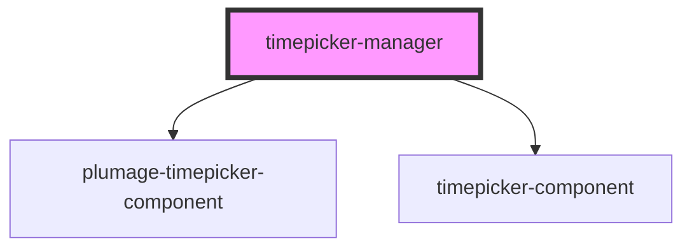

# timepicker-manager

<!-- Auto Generated Below -->

## Overview

Timepicker Manager
- Forwards props to either <timepicker-component> or <plumage-timepicker-component>
- a11y precedence: aria-labelledby (if provided) > aria-label
- Forwards aria-describedby to child; optionally merges in the child's validation message id

NOTE:
508 compliance depends primarily on the child component’s semantics/keyboard behavior.

## Properties

| Property                 | Attribute                    | Description                                                                                                                                    | Type               | Default        |
| ------------------------ | ---------------------------- | ---------------------------------------------------------------------------------------------------------------------------------------------- | ------------------ | -------------- |
| `ariaDescribedby`        | `aria-describedby`           | Optional description ids (space-separated).                                                                                                    | `string`           | `undefined`    |
| `ariaLabel`              | `aria-label`                 | Accessible name override via aria-label (used only when ariaLabelledby is NOT provided).                                                       | `string`           | `undefined`    |
| `ariaLabelledby`         | `aria-labelledby`            | Accessible name override via aria-labelledby (space-separated ids). Takes precedence over aria-label.                                          | `string`           | `undefined`    |
| `disableTimepicker`      | `disable-timepicker`         | Disable the timepicker. - For <timepicker-component>: passed as `disableTimepicker` - For <plumage-timepicker-component>: passed as `disabled` | `boolean`          | `false`        |
| `hideSeconds`            | `hide-seconds`               |                                                                                                                                                | `boolean`          | `false`        |
| `hideTimepickerBtn`      | `hide-timepicker-btn`        |                                                                                                                                                | `boolean`          | `false`        |
| `inputId`                | `input-id`                   | ID to pass to inner input(s). Should be unique per instance.                                                                                   | `string`           | `'time-input'` |
| `inputName`              | `input-name`                 | Name attribute for the inner input                                                                                                             | `string`           | `'time'`       |
| `inputWidth`             | `input-width`                | Width (px) for the input element                                                                                                               | `number \| string` | `null`         |
| `isTwentyFourHourFormat` | `is-twenty-four-hour-format` |                                                                                                                                                | `boolean`          | `true`         |
| `isValid`                | `is-valid`                   |                                                                                                                                                | `boolean`          | `true`         |
| `labelText`              | `label-text`                 |                                                                                                                                                | `string`           | `'Enter Time'` |
| `required`               | `required`                   | Required indicator                                                                                                                             | `boolean`          | `false`        |
| `showLabel`              | `show-label`                 |                                                                                                                                                | `boolean`          | `undefined`    |
| `size`                   | `size`                       |                                                                                                                                                | `string`           | `''`           |
| `twelveHourOnly`         | `twelve-hour-only`           |                                                                                                                                                | `boolean`          | `false`        |
| `twentyFourHourOnly`     | `twenty-four-hour-only`      |                                                                                                                                                | `boolean`          | `false`        |
| `usePlTimepicker`        | `use-pl-timepicker`          | Choose which implementation to render                                                                                                          | `boolean`          | `false`        |
| `validation`             | `validation`                 |                                                                                                                                                | `boolean`          | `false`        |
| `validationMessage`      | `validation-message`         |                                                                                                                                                | `string`           | `''`           |

## Dependencies

### Depends on

- [plumage-timepicker-component](.)
- [timepicker-component](.)

### Graph

```mermaid
graph TD;
  timepicker-manager --> plumage-timepicker-component
  timepicker-manager --> timepicker-component
  style timepicker-manager fill:#f9f,stroke:#333,stroke-width:4px
```

----------------------------------------------

*Built with [StencilJS](https://stenciljs.com/)*
