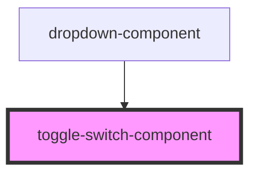

# toggle-switch-component

<!-- Auto Generated Below -->

## Properties

| Property            | Attribute            | Description | Type                           | Default                    |
| ------------------- | -------------------- | ----------- | ------------------------------ | -------------------------- |
| `checked`           | `checked`            |             | `boolean`                      | `false`                    |
| `customSwitch`      | `custom-switch`      |             | `boolean`                      | `false`                    |
| `disabled`          | `disabled`           |             | `boolean`                      | `false`                    |
| `inline`            | `inline`             |             | `boolean`                      | `false`                    |
| `inputId`           | `input-id`           |             | `string`                       | `''`                       |
| `labelTxt`          | `label-txt`          |             | `string`                       | `''`                       |
| `newToggleTxt`      | `new-toggle-txt`     |             | `{ on: string; off: string; }` | `{ on: 'On', off: 'Off' }` |
| `required`          | `required`           |             | `boolean`                      | `false`                    |
| `size`              | `size`               |             | `string`                       | `''`                       |
| `switches`          | `switches`           |             | `boolean`                      | `false`                    |
| `switchesArray`     | `switches-array`     |             | `ToggleItem[]`                 | `[]`                       |
| `toggleTxt`         | `toggle-txt`         |             | `boolean`                      | `false`                    |
| `validation`        | `validation`         |             | `boolean`                      | `false`                    |
| `validationMessage` | `validation-message` |             | `string`                       | `''`                       |
| `value`             | `value`              |             | `string`                       | `''`                       |

## Events

| Event            | Description | Type                                             |
| ---------------- | ----------- | ------------------------------------------------ |
| `checkedChanged` |             | `CustomEvent<{ id: string; checked: boolean; }>` |

## Dependencies

### Used by

 - [dropdown-component](../dropdown)

### Graph

----------------------------------------------

*Built with [StencilJS](https://stenciljs.com/)*
