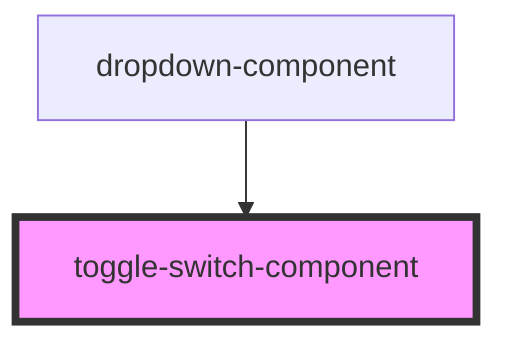

# toggle-switch-component

<!-- Auto Generated Below -->

## Overview

Accessibility / 508 notes (high level):
- Single switch:
  - native <input type="checkbox"> with role="switch"
  - label is associated via htmlFor/id
  - invalid state uses aria-invalid + aria-describedby -> validation message id
  - when label text is empty, provide an aria-label fallback

- Switch group (multiple switches):
  - group wrapper uses role="group"
  - group invalid state uses aria-invalid + aria-describedby -> group validation id (inline mode)
  - each invalid item input also uses aria-invalid + aria-describedby -> its own validation message id
  - all ids are derived from inputId/item.id (no random ids needed for wiring)

## Properties

| Property            | Attribute            | Description                                                                                                                               | Type                           | Default                    |
| ------------------- | -------------------- | ----------------------------------------------------------------------------------------------------------------------------------------- | ------------------------------ | -------------------------- |
| `ariaLabel`         | `aria-label`         | A11y fallback name for single-switch usage when labelTxt is empty. (If labelTxt exists, label association is preferred.)                  | `string`                       | `'Toggle'`                 |
| `ariaLabelledby`    | `aria-labelledby`    | Optional: label the group wrapper (multiple switches) when you have a visible label elsewhere. Example: ariaLabelledby="someLabelId"      | `string`                       | `''`                       |
| `checked`           | `checked`            |                                                                                                                                           | `boolean`                      | `false`                    |
| `customSwitch`      | `custom-switch`      |                                                                                                                                           | `boolean`                      | `false`                    |
| `disabled`          | `disabled`           |                                                                                                                                           | `boolean`                      | `false`                    |
| `inline`            | `inline`             |                                                                                                                                           | `boolean`                      | `false`                    |
| `inputId`           | `input-id`           |                                                                                                                                           | `string`                       | `''`                       |
| `labelTxt`          | `label-txt`          |                                                                                                                                           | `string`                       | `''`                       |
| `newToggleTxt`      | --                   | Programmatic API (property): el.newToggleTxt = { on:'On', off:'Off' } IMPORTANT: do not mutate this prop internally.                      | `{ on: string; off: string; }` | `{ on: 'On', off: 'Off' }` |
| `newToggleTxtAttr`  | `new-toggle-txt`     | Attribute API: <toggle-switch-component new-toggle-txt='{"on":"A","off":"B"}'> This is a STRING prop because HTML attributes are strings. | `string`                       | `''`                       |
| `required`          | `required`           |                                                                                                                                           | `boolean`                      | `false`                    |
| `size`              | `size`               |                                                                                                                                           | `string`                       | `''`                       |
| `switches`          | `switches`           |                                                                                                                                           | `boolean`                      | `false`                    |
| `switchesArray`     | --                   |                                                                                                                                           | `ToggleItem[]`                 | `[]`                       |
| `toggleTxt`         | `toggle-txt`         |                                                                                                                                           | `boolean`                      | `false`                    |
| `validation`        | `validation`         |                                                                                                                                           | `boolean`                      | `false`                    |
| `validationMessage` | `validation-message` |                                                                                                                                           | `string`                       | `''`                       |
| `value`             | `value`              |                                                                                                                                           | `string`                       | `''`                       |

## Events

| Event            | Description | Type                                             |
| ---------------- | ----------- | ------------------------------------------------ |
| `checkedChanged` |             | `CustomEvent<{ id: string; checked: boolean; }>` |

## Dependencies

### Used by

 - [dropdown-component](../dropdown)

### Graph

```mermaid
graph TD;
  dropdown-component --> toggle-switch-component
  style toggle-switch-component fill:#f9f,stroke:#333,stroke-width:4px
```

----------------------------------------------

*Built with [StencilJS](https://stenciljs.com/)*
